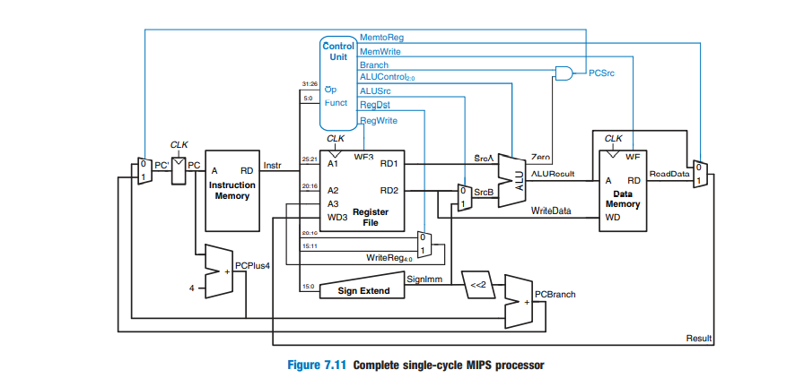

# Single-cycle-MIPS-processor-based-on-Harvard-architecture-using-Verilog-HDL

The implementation consists of 4 main blocks:
- Data Path.
- Control Unit.
- Instruction Memory.
- Data Memory.

The simulation was performed on Modelsim using the following three programs written in machine 
code following MIPS ISA:
Program 1: GCD of 120 and 180.
Program 2: Factorial Number of 7.
Program 3: The Fibonacci series numbers.
The synthesis was done on Intel® Quartus Prime and implemented on Cyclone® IV FPGA.

# DataPath

